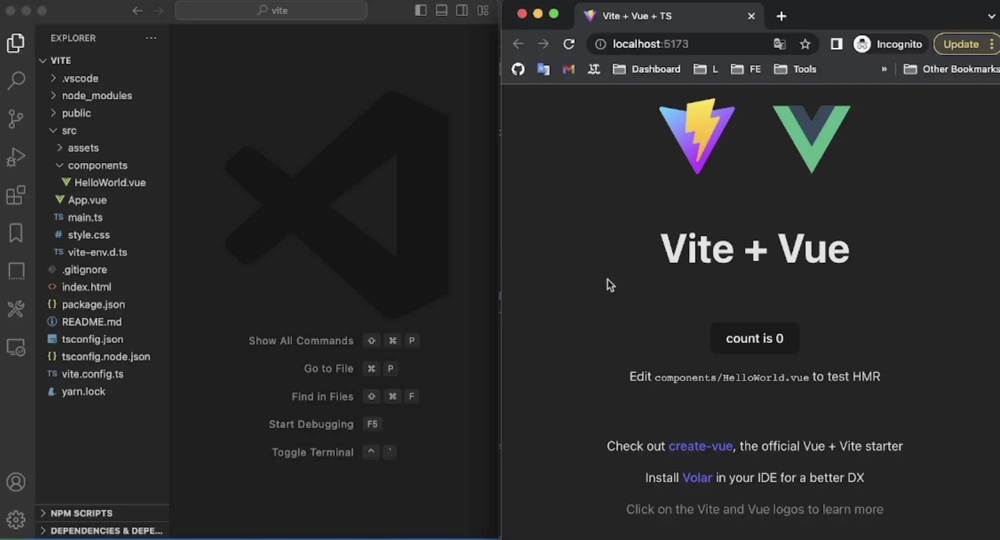
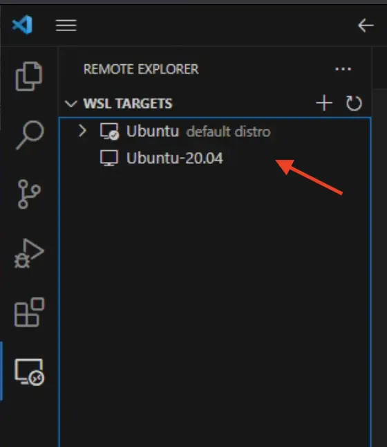

# vue-click-to-component

[](https://www.npmjs.com/package/vue-click-to-component)

English | [简体中文](./README.zh-CN.md)

<kbd>Option+Click</kbd>(<kbd>Alt+Click</kbd>) a element in the browser to **instantly** goto the source in your editor.



<kbd>Option+RightClick</kbd>(<kbd>Alt+RightClick</kbd>) opens a context menu with the parent elements.

## Features

- <kbd>Option+Click</kbd>(<kbd>Alt+Click</kbd>) opens the immediate Component's source
- Supports `vscode`, `vscode-insiders` and `webstorm`'s [URL handling](https://code.visualstudio.com/docs/editor/command-line#_opening-vs-code-with-urls)
- Automatically **tree-shaken** from `production` builds

## Installation

### npm

```shell
npm install vue-click-to-component
```

### pnpm

```shell
pnpm add vue-click-to-component
```

### yarn

```shell
yarn add vue-click-to-component
```

Even though `vue-click-to-component` is added to `dependencies`, [tree-shaking](https://esbuild.github.io/api/#tree-shaking) will remove `vue-click-to-component` from `production` builds.

## Usage

### Vite

[`vite.config.ts`](./examples/vite/vite.config.ts#L7)

```diff
import { defineConfig } from 'vite'
import vue from '@vitejs/plugin-vue'
+import vueClickToComponent from 'vue-click-to-component/vite-plugin';

// https://vitejs.dev/config/
export default defineConfig({
-  plugins: [vue()],
+  plugins: [vueClickToComponent(), vue()],
})
```

[`main.ts`](./examples/vite/src/main.ts#L4)

```diff
import { createApp } from 'vue'
import './style.css'
import App from './App.vue'
+import 'vue-click-to-component/client';

createApp(App).mount('#app')
```

### Vue CLI

[`vue.config.js`](./examples/vue-cli/vue.config.js#L6-L8)

```diff
const { defineConfig } = require("@vue/cli-service");
+const vueClickToComponent = require("vue-click-to-component/vue-cli-plugin");

module.exports = defineConfig({
  transpileDependencies: true,
+  chainWebpack: (config) => {
+    vueClickToComponent(config);
+  },
});
```

[`main.js`](./examples/vue-cli/src/main.js#L3)

```diff
import Vue from 'vue'
import App from './App.vue'
+import 'vue-click-to-component/client.js'

Vue.config.productionTip = false

new Vue({
  render: h => h(App),
}).$mount('#app')
```

### webpack

[`webpack.config.js`](./examples/webpack/webpack.config.js#L31-L35)

```diff
module: {
  rules: [
+    {
+        test: /\.vue$/,
+        enforce: 'pre',
+        loader: 'vue-click-to-component/loader',
+    },
    {
        test: /\.vue$/,
        loader: 'vue-loader',
    },
  ],
},
```

[`main.js`](./examples/webpack/src/index.js#L3)

```diff
import { createApp } from "vue";
import App from "./App.vue";
+import "vue-click-to-component/client.js";

createApp(App).mount("#app");
```

[`package.json`](./examples/webpack/package.json#L10)

```diff
"scripts": {
-  "serve": "webpack serve"
+  "serve": "NODE_ENV=development webpack serve"
},
```

### Configure the URL to open the editor

By default, clicking will open [`vscode`](https://code.visualstudio.com/), and generally does not need the following configuration. Those configurations are only required if the following situations are used.

<details>
<summary>Visual Studio Code Insiders</summary>

If you use [`vscode-insiders`](https://code.visualstudio.com/insiders/), you can set editor like:

```diff
import 'vue-click-to-component/client';

+if (process.env.NODE_ENV === 'development') {
+  window.__VUE_CLICK_TO_COMPONENT_URL_FUNCTION__ = function ({
+    sourceCodeLocation
+  }) {
+    return `vscode-insiders://file/${sourceCodeLocation}`;
+  };
+}
```

</details>

<details>
<summary>WSL</summary>

If you use [WSL](https://docs.microsoft.com/en-us/windows/wsl/), you can set URL like:

```diff
import 'vue-click-to-component/client';

+if (process.env.NODE_ENV === 'development') {
+  window.__VUE_CLICK_TO_COMPONENT_URL_FUNCTION__ = function ({
+    sourceCodeLocation
+  }) {
+    // Please change to your WSL target
+    const wslTarget = 'Ubuntu-22.04';
+    return `vscode://vscode-remote/wsl+${wslTarget}/${sourceCodeLocation}`;
+  };
+}
```

You can find your WSL target in the `Remote Explorer` panel of VSCode.



</details>

<details>
<summary>Docker</summary>

If you use [Docker](https://www.docker.com/) development environment, you can fix path like:

```diff
import 'vue-click-to-component/client';

+if (process.env.NODE_ENV === 'development') {
+  window.__VUE_CLICK_TO_COMPONENT_URL_FUNCTION__ = function ({
+    sourceCodeLocation
+  }) {
+    // Please change to your docker work dir
+    const dockerWorkDir = '/usr/src/app';
+    // Please change to your local work dir
+    const workDir = '/Users/zjf/gh/vue-click-to-component/examples/vite';
+
+    let realSourceCodeLocation = sourceCodeLocation;
+    if (realSourceCodeLocation.startsWith(dockerWorkDir)) {
+      realSourceCodeLocation = `${workDir}${realSourceCodeLocation.slice(dockerWorkDir.length)}`;
+    }
+
+    return `vscode://file/${realSourceCodeLocation}`;
+  };
+}
```

</details>

<details>
<summary>WebStorm</summary>

If you use [WebStorm](https://www.jetbrains.com/webstorm/), you can set URL like:

```diff
import 'vue-click-to-component/client';

+if (process.env.NODE_ENV === 'development') {
+  window.__VUE_CLICK_TO_COMPONENT_URL_FUNCTION__ = function ({
+    sourceCodeLocation
+  }) {
+    const [path, line, column] = sourceCodeLocation.split(':');
+    return `webstorm://open?file=${path}&line=${line}&column=${column}`;
+  };
+}
```

PS: According to my test, the file can be opened, but the lines and columns do not take effect. If anyone knows how to make lines and columns work please tell me, thanks.

</details>

### Force enable

By default, this tool is only enabled in the development environment (`NODE_ENV` is `development`). If you want to enable it in the production environment, you can configure it like below:

`main.ts`:

```diff
-import 'vue-click-to-component/client';
+import 'vue-click-to-component/client-force-enable';
```

`package.json`:

```diff
-"build": "vue-tsc && vite build",
+"build": "vue-tsc && VUE_CLICK_TO_COMPONENT_FORCE_ENABLE=true vite build",
```
